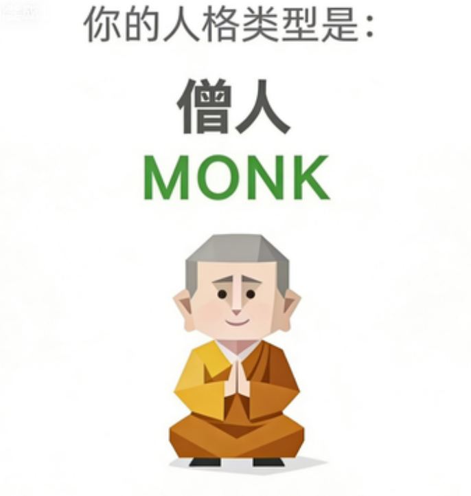

# SBTI 傻呼呼大人格测试

一个通过 Claude Code 运行的趣味人格测试 Skill，支持测试引导、结果存储、历史查询和诙谐解读。



## 简介

SBTI（傻呼呼大人格测试）是一款基于 30 道常规题 + 2 道特殊关卡题的人格测试工具。通过幽默的自嘲式问答，挖掘你内心深处的"傻呼呼"人格特质。

测试包含 15 个维度：自尊自信、自我清晰度、核心价值、依恋安全感、情感投入度、边界与依赖、世界观倾向、规则与灵活度、人生意义感、动机导向、决策风格、执行模式、社交主动性、人际边界感、表达与真实度。

## 功能特性

- **智能问答引导**：LLM 内存中随机打乱题目顺序，每批 5 题分批展示
- **关卡触发机制**：特殊题目（如饮酒测试）可触发强制人格类型
- **结果存储**：基于用户 ID 的历史记录管理
- **历史查询**：支持查看历次测试结果
- **诙谐解读**：基于作者风格的深度人格解读
- **结果卡片**：生成 ljg-card 风格信息图

## 项目结构

```
sbti-skill/
├── SKILL.md              # 核心 Skill 定义
├── sbti.skill            # Skill 包文件
├── image/                # 32 种人格类型图片
├── scripts/
│   ├── sbti_engine.py    # 结果计算引擎
│   ├── user_manager.py   # 用户身份管理
│   ├── storage.py        # 历史记录存储
│   ├── generate_result_card.py  # 卡片生成
│   ├── install_self_test.py     # 安装自检
│   └── capture.js        # 截图脚本
├── references/
│   ├── questions.json     # 题库数据
│   ├── type-library.json  # 32 种人格类型定义
│   ├── dimension-library.json  # 15 维度定义
│   ├── author-voice.md    # 作者风格指南
│   └── SBTI_题库数据.md   # 题库文档
└── data/                 # 用户数据存储
```

## 安装使用

### 作为 Claude Code Skill 安装

1. 将 `sbti-skill` 目录放入 Claude Code 的 skills 目录
2. 在 Claude Code 中使用 `/sbti` 唤起测试

### 本地运行

```bash
# 安装依赖
pip install -r requirements.txt  # 如有

# 运行安装自检
cd sbti-skill
python scripts/install_self_test.py

# 启动测试引导
# （通过 Claude Code 调用 SKILL.md 中定义的工作流程）
```

## 人格类型

测试涵盖 32 种人格类型，包括：

| 代码 | 名称 | 代码 | 名称 |
|------|------|------|------|
| SOLO | 独行侠 | DRUNK | 酒神 |
| BOSS | 老板 | CTRL | 控制狂 |
| ATM | 提款机 | FAKE | 伪君子 |
| SEXY | 老司机 | MALO | 渣男/渣女 |
| JOKE | 逗比 | GOGO | 行动派 |
| IMFW | 我完蛋了 | IMSB | 我是逼 |
| HHHH | 哈哈哈 | OJBK | 皮一下 |
| POOR | 穷比 | SHIT | 屎命必达 |
| DEAD | 死了 | DIOR | 精致逼 |
| THIN-K | 思考者 | THAN-K | 感恩人 |
| MUM | 妈妈 | MONK | 修行僧 |
| LOVE-R | 恋爱脑 | WOC | 我的天 |
| FUCK | 暴躁老哥 | OH-NO | 社恐 |
| ZZZZ | 睡神 | 等等 | ... |

## 数据来源

- 题库数据：基于 B站@蛆肉儿串儿 原创作业题库
- 原始测试地址：https://sbti.unun.dev

## 注意事项

- 测试结果仅供娱乐，请勿当真
- 人格类型解读采用自嘲幽默风格，请勿上升到真实人格判断
- 用户数据本地存储，不会上传至任何服务器
